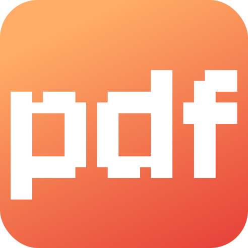

# PDF Tool

A free online PDF editor that allows you to merge, split, and edit PDF files with an easy drag-and-drop interface.

## Features

- Merge multiple PDF files into one document
- Split PDF files into separate pages or sections
- Remove specific pages from PDF files
- Compress PDF files to reduce file size
- Rotate pages within PDF files
- Add watermarks to PDF documents
- Edit PDF metadata and properties

Access the tool at [https://pdftools.knoctal.com/](https://pdftools.knoctal.com/)
